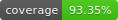
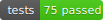
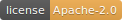

# clickhouse-dsl

[한국어 README](./README.md)






`clickhouse-dsl` is a Java 17+ typed Query DSL for building ClickHouse SQL more safely and readably.

The project is intentionally focused on building, validating, and rendering SQL strings from Java code. It is not trying to become a full ORM or transport-heavy execution framework.

- Express ClickHouse-oriented syntax in Java code
- Push as many mistakes as possible into compile-time guardrails
- Use semantic validation for the rules Java's type system cannot enforce cleanly
- Keep the model POJO-friendly, immutable, and lightweight
- Render with placeholders to reduce SQL injection risk

## AI Guides

If you want an AI agent to use this repository predictably, start here.

- [`skills/clickhouse-dsl/SKILL.md`](./skills/clickhouse-dsl/SKILL.md)
- [`docs/ai/CODEX.md`](./docs/ai/CODEX.md)
- [`docs/ai/CLAUDE.md`](./docs/ai/CLAUDE.md)

## Getting Started

Add the dependency:

Gradle:

```gradle
dependencies {
    implementation("io.github.heonny:clickhouse-dsl:0.1.2")
}
```

Maven:

```xml
<dependency>
    <groupId>io.github.heonny</groupId>
    <artifactId>clickhouse-dsl</artifactId>
    <version>0.1.2</version>
</dependency>
```

Verify the project locally:

```bash
./gradlew test
./gradlew check
```

For deeper documents:

- [`docs/guide.md`](./docs/guide.md)
- [`docs/VERSIONING.md`](./docs/VERSIONING.md)
- [`docs/RELEASE.md`](./docs/RELEASE.md)

Recommended reading order:

1. `Quick Example` below
2. [`ReadmeExampleTest.java`](./src/test/java/io/github/heonny/clickhousedsl/api/ReadmeExampleTest.java)
3. `samples/basic`
4. `samples/advanced`
5. `samples/realworld`

## Current Scope

Supported today:

- `SELECT`
- `FROM`
- `WHERE`
- `PREWHERE`
- `JOIN`
- `GROUP BY`
- `HAVING`
- `ORDER BY`
- `LIMIT`
- `SETTINGS`
- `ARRAY JOIN`
- `SAMPLE`
- `WITH`
- `UNION` / `UNION ALL`
- window functions such as `rowNumber` and `sum(...).over(...)`
- aggregate state helpers such as `sumState` and `sumMerge`
- `EXPLAIN` query model plus raw explain text analysis
- execution metrics POJOs

Still intentionally incomplete:

- deeper ClickHouse transport integration
- server-side explain fetching
- benchmark runner
- broader function type coverage
- detailed window frame syntax

## Safe Usage

For production code, prefer this flow:

1. Build a `Query` with the DSL.
2. Call `validateOrThrow(query)` or `renderValidatedQuery(query)`.
3. Pass the rendered SQL and ordered parameters to your existing execution layer.

Example:

```java
Query query = select(userName, count())
    .from(users)
    .groupBy(userName)
    .build();

RenderedQuery rendered = renderValidatedQuery(query);

jdbcTemplate.query(
    rendered.sql(),
    rendered.parameters().toArray(),
    rowMapper
);
```

Avoid:

- calling `render(query)` on user-influenced queries and skipping validation
- ignoring `ValidationResult`
- adding the same setting twice

The executor code inside this repository is secondary. The recommended integration style is still: validate, render, then hand SQL to `JdbcTemplate`, MyBatis, or your existing execution boundary.

## Aggregate State Safety

For aggregate-state tables:

1. declare state fields with `stateColumn(...)`
2. merge them with `countMerge`, `countIfMerge`, `uniqMerge`, or `sumMerge`
3. finish with `renderValidatedQuery(query)` and hand the result to your existing execution tool

## Design Position

This library is not trying to be a generic SQL DSL or ORM.

`A typed middle layer that is more faithful to ClickHouse than generic DSLs, and safer than raw string SQL.`

## Why Not JPA / JdbcTemplate / MyBatis

| Approach | Strength | Limitation |
|--------|------|------|
| JPA / Criteria | Familiar for entity-centric CRUD | Weak fit for ClickHouse-heavy analytics queries and specialized functions |
| JdbcTemplate + string SQL | Direct and fast | No compile-time guardrails; dynamic branching degrades quickly |
| MyBatis XML / `@NativeQuery` | Explicit SQL is familiar | Complex dynamic queries become difficult to maintain and validate structurally |
| `clickhouse-dsl` | Keeps ClickHouse syntax while improving guardrails, snapshots, and composability | Execution is still best handled by existing tools like `JdbcTemplate` |

## Quick Example

```java
import static io.github.heonny.clickhousedsl.api.ClickHouseDsl.*;

Table users = Table.of("analytics.users").as("u").finalTable();
Table events = Table.of("analytics.events").as("e");

var userId = users.column("id", Long.class);
var userName = users.column("name", String.class);
var age = users.column("age", Integer.class);
var score = users.column("score", Integer.class);
var tags = users.arrayColumn("tags", String.class);
var eventUserId = events.column("user_id", Long.class);

Query query = select(
        userName,
        count(),
        rowNumber(window().partitionBy(userName).orderBy(age.desc())),
        io.github.heonny.clickhousedsl.model.Expressions.sum(score)
            .over(window().partitionBy(userName).orderBy(age.asc()))
    )
    .from(users)
    .innerJoin(events).on(userId, eventUserId)
    .arrayJoin(tags)
    .prewhere(age.gt(18))
    .where(userName.eq("alice"))
    .groupBy(userName)
    .having(count().gt(param(1L, Long.class)))
    .limit(100)
    .settings(maxThreads(4), maxMemoryUsage(268_435_456L), useUncompressedCache(true))
    .build();

RenderedQuery rendered = renderValidatedQuery(query);
```
